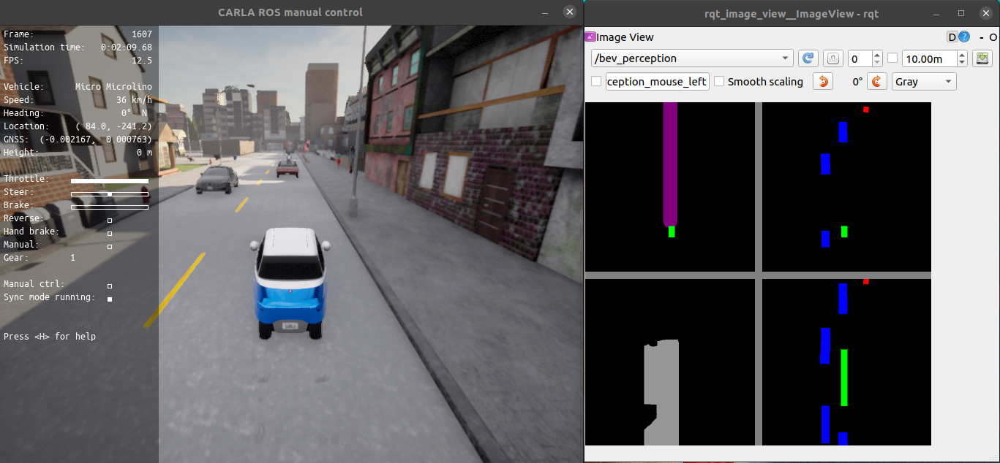

# Risk-Aware Reinforcement Learning with Spatio-Temporal Adversary Representation for Autonomous Driving

This repository contains the code for the paper **Risk-Aware Reinforcement Learning with Spatio-Temporal Adversary Representation for Autonomous Driving**.

**_Performance under Non-Adversarial Scenarios_**
<figure>
  
</figure>

**_Performance under Adversarial Scenarios_**
<figure>
  
</figure>


## Contents
1. [Setup](#setup)
2. [Training](#training)
3. [Testing](#testing)
4. [Demo](#demo)
5. [References](#References)

## Setup

The implementation of the entire project depends on the following environments:

-  ROS Noetic
- carla 0.9.12
- carla-ros-bridge 0.9.12

Please ensure that carla and the ROS bridge are successfully configured on your system before proceeding with the subsequent environment configurations. The following content may help you complete the setup of the above environments.

We are using the carla-0.9.12 Released version. 
Download [carla-0.9.12 and AdditionalMaps-0.9.12](https://github.com/carla-simulator/carla/releases). Then you can follow the steps below to configure the simulation environment.

### 1.1 carla config

```Shell
mkdir carla12
cd carla12
tar -xf CARLA_0.9.12.tar.gz
tar -xf AdditionalMaps_0.9.12.tar.gz
```

Then, you can configure your environment variables by following these steps.

```Shell
gedit ~/.bashrc

# Input these lines into your ~/.bashrc
export CARLA_ROOT="(where your carla)/carla12"
export PYTHONPATH=$PYTHONPATH:${CARLA_ROOT}/PythonAPI/carla/dist/carla-0.9.12-py3.7-linux-x86_64.egg
export PYTHONPATH=$PYTHONPATH:${CARLA_ROOT}/PythonAPI/carla/agents
export PYTHONPATH=$PYTHONPATH:${CARLA_ROOT}/PythonAPI/examples
export PYTHONPATH=$PYTHONPATH:${CARLA_ROOT}/PythonAPI/carla
export PYTHONPATH=$PYTHONPATH:${CARLA_ROOT}/PythonAPI

# we write two alias to open carla in two modes [render on or off]
alias carla="(where your carla)/carla12/CarlaUE4.sh"
alias carla_no_rendering="(where your carla)/carla12/CarlaUE4.sh -RenderOffScreen"
```

Regarding the configuration of the carla-ros-bridge, you can refer to the [official link](https://github.com/carla-simulator/ros-bridge).

### 1.2 Spatial Critical Representation (SCR) package compile

To use the spatial-critical representation(SCR), we have written a C++ ROS package. The
SCR is a perception method based on ray-casting output format, which has been mentioned in our [previous work](https://ieeexplore.ieee.org/abstract/document/10242384). The configuration steps are
as follows.

```Shell
git clone https://github.com/quliang93/STRA_RL
cd settings
cp -r cad_gt_carla (your carla-ros-bridge)/catkin_ws/src/ros-bridge/

# compile this package alone
cd (your carla-ros-bridge)/catkin_ws/
catkin_make -DCATKIN_WHITELIST_PACKAGES="cad_gt_carla"
```
### 1.3 Launch files
After compiling this package, you need to place the pre-written sensor configuration files and launch files into the corresponding folders.
```Shell
# cp my launch file into the target directory
cp settings/launch_configs/ablation_ours_bev_town2.launch (your carla-ros-bridge)/catkin_ws/src/ros-bridge/carla_ros_bridge/launch/

# cp the sensor.json into the target directory
cp settings/launch_configs/dsb_objects_bev.json (your carla-ros-bridge)/catkin_ws/src/ros-bridge/carla_spawn_objects/config/
```

### 1.4 Environment check
After the environment configuration is complete, you can follow the steps below to verify if the configuration was successful.
You can use a tool like Conda to manage your environment. The other required packages for the environment can be referenced in `stra_rl_environment.yaml`. I have created a package environment named `carla12` for the entire project.
#### 1.4.1 launch carla

```Shell
carla_no_rendering
```

#### 1.4.2 launch carla-ros-bridge
```Shell
conda activate carla12
roslaunch carla_ros_bridge stra_rl_town02.launch
```
#### 1.4.3 environment check
```Shell
conda activate carla12
cd STRA_RL/
python stra_rl_config.py
```

Use the `rqt_image_view` to check the `/bev_perception` topic. If the following screen appears,
then the entire configuration has been successfully completed.



## Training

The entire training process consists of two curriculum learning phases. The first phase involves training in regular scenarios. After completing the first phase, the second phase focuses on training under different adversarial scenarios, with the preloaded weights for the second phase being the best weights obtained from the first phase. The complete training process is as follows.

### 2.1 Launch carla
```Shell
carla_no_rendering
```
### 2.2 Launch the carla-ros-bridge
```Shell
conda activate carla12
roslaunch carla_ros_bridge stra_town02.launch
```

### 2.3 Start training
```Shell
conda activate carla12
cd STRA_RL
python train_stage_I.py

# after stage I training finished, start training stage II
python train_stage_II.py
```

## Testing
Follow 2.1-2.3 to launch carla and ros-bridge, and then
```Shell
# test driving agent in high-dense dynamic scenarios
python test.py

# test driving agent in adversarial scenarios
python test_adversarial.py
```

## Demo
Coming soon.

## References
We appreciate these following related works: [rl-collision-avoidance](https://github.com/Acmece/rl-collision-avoidance), [carla-bireye-view](https://github.com/deepsense-ai/carla-birdeye-view), [carla-roach](https://github.com/zhejz/carla-roach), and [CADLabeler](https://github.com/BruceXSK/CADLabeler).
